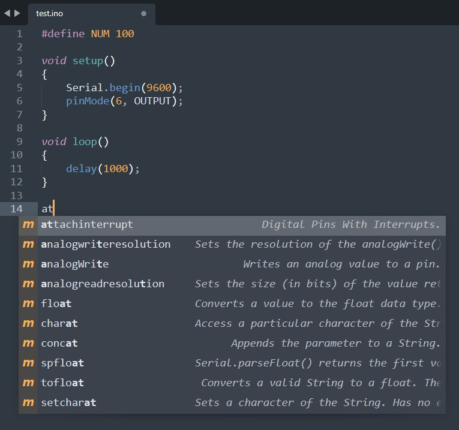

# 📝 Arduino snippets for SUBLIME TEXT
> Auto-Complete / Auto-suggestion for arduino (.ino/.c) file for Sublime Text Editor (3/4)

## 💻 Screenshot

## 📩 Usage

Download the `Arduino_Sublime.sublime-completions` file and paste it at the following location :

**For Portable Version >>**

`\Data\Packages\User` inside the application folder.

**For Installer Version >>**

`C:\Users\$_USER_NAME_$\AppData\Roaming\Sublime Text 3\Packages\User`. 

NOTE: *please check this path for your sublime text version.*

 

**NOTE:** for the auto-complete to work on a file, it should have a `.c` extention. If the file has `.ino` extention then in Sublime Text go to :

`> View > Syntax > Open all with current extention as >` and select `C` there.

## 🙌 Acknowledgements

Thanks to [@ronaldosena](https://github.com/ronaldosena).
The `.json` file is taken from [arduino-snippets](https://github.com/ronaldosena/arduino-snippets) and translated to match the `.sublime-completions` file [guidelines](https://www.sublimetext.com/docs/completions.html).
